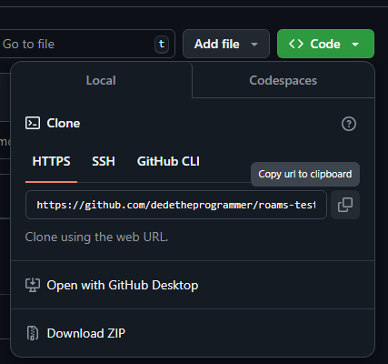

# Roams Backend API Test
A continuación se describe los pasos a seguir para la utilización de la API implementada, esta puede ser accedida desde el navegador, ya que se ha implementado una interfaz para poder probarse.

La versión de Python utilizada es la `v3.12.6` y ha sido desarrollado en Windows.

Para la ejecución de la API, seguir los siguientes pasos:

0. Se puede obtener el link del repositorio así:

    

1. Clonar el repositorio:

    ```sh
    git clone https://github.com/dedetheprogrammer/roams-test-monorepo.git
    ```

2. Moverse a la carpeta roams-test-monorepo

    ```sh
    cd roams-test-monorepo
    ```

3. Ejecutar alguno de los scripts. **Cualquiera de las tres formas es válida** y solo se requiere de una:

    - Si se pueden ejecutar `Shell scripts` en Windows:

        ```sh
        chmod 0700 run.sh # Unicamente en Linux, no es necesario en Windows.
        ./run.sh
        ```

    - Si se tiene Windows o no se pueden ejecutar shell scripts y se pueden ejecutar `Powershell scripts`:

        ```
        run.ps1
        ```
    
    - Si se tiene Docker instalado:

        ```sh
        docker 
        ```

    - Si no se puede ninguna:

        1. Crear un nuevo entorno virtual y copiar la carpeta de `app` dentro:

            ```sh
            python -m pip virtualenv # Unicamente si no se tiene ya instalado
            python -m venv roams-venv
            cp -r app roams-venv
            ```

        2. Activar el entorno virtual:

            ```sh
            cd roams-venv && .\Script\activate
            ```

        3. Instalar las dependencias:

            ```sh
            python -m pip install -r requirements.txt
            ```
        
        4. Iniciar el servidor:

            ```sh
            python app/server.py
            ```
        
        5. Para salir y limpiar los restos:

            ```sh
            deactivate
            cd ..
            rm -r roams-venv
            ```


3. Una vez ejecutado, la dirección definida por defecto es http://localhost:5000 o http://127.0.0.1:5000 que será accesible desde el navegador.


